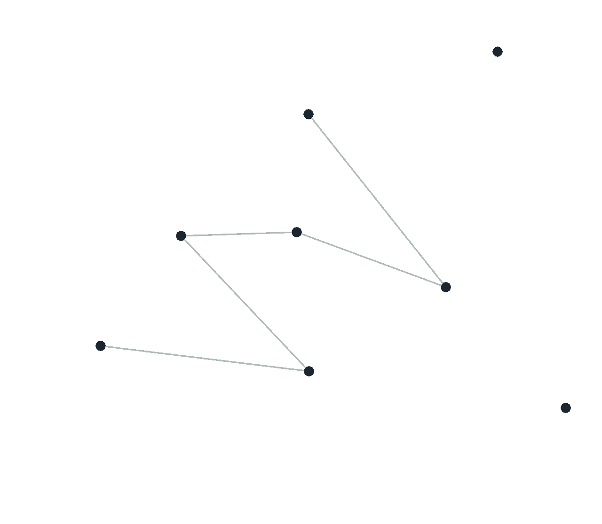
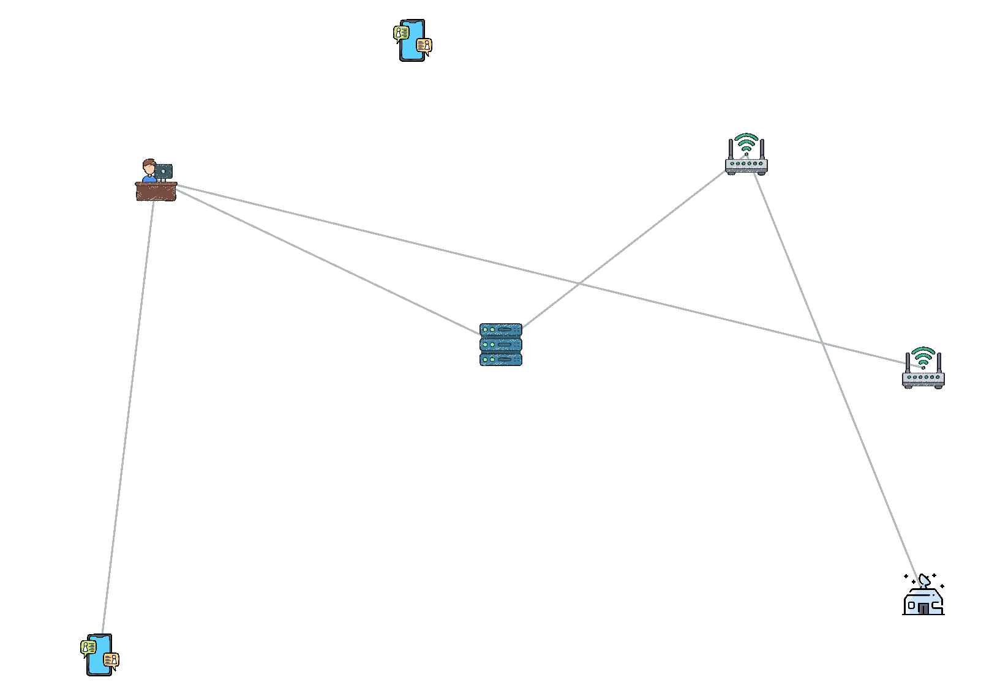

# Author(s) 👨‍🔬

- Kassi Bertrand (me 👻)

# Project Description 📜

The project consisted in creating an interactive network vizualization, and simulating basic interactions among entities involved in the network.

# Why this project?

During the winter break, I purchased a physical copy of [Algorithms (4th Edition)](https://www.amazon.com/Algorithms-4th-Robert-Sedgewick/dp/032157351X/ref=pd_lpo_2?pd_rd_i=032157351X&psc=1). I read the first chapter (Fundamentals) and was inspired by the "Union-Find" section. I wanted to: 

**Build** something (different from the textbook example) from scratch, to apply the concepts (sites, components, etc.) I learned in a new scenario to test my understanding. 

# Specifications of the project

1. Every time the user clicks on the screen, a node should enters the network, and randomly connect to another node in the network.

2. A connection is made _if and only if_ the pair is not - directly or indirectly - connected

_Note: Those specs may change over time, as the program improves_ If they do, they'll be marked as "radioactive" ☢️.

# Technologies, Tools, Frameworks used(option) 🛠️

- [p5.js](https://p5js.org/): A JavaScript library to for creative coding.

- [Flaticon](https://www.flaticon.com/): An icon library.

# Results

Here are some pictures showing the evolution of the project.

1. First Iteration: Using spheres

2. Second Iteration: Using PNG files

3. Current Iteration: Attempting animation

# Potential Improvements 🌱

_Note: ✔️ = Implemented   ❌ = not implemented_

1. **_Users get to make connections themselves_**. Instead of connections being randomly generated, we can make sure users can click on nodes they want to connect or disconnect. ❌

2. **_Allow users to update the position of nodes in real-time, using drag and drop_**. Once a node is displayed at an `(x,y)` position, it can no longer be moved around. I think it would be interesting for the users to drag and drop icons where they want. ❌

3. **_Images over spheres_**. Instead of spheres, we use cool PNG images to display nodes. ✔️

4. **_Communication_**. Allow nodes, once connected, to send each other "fake messages" (or "fake packets") represented by small spheres. ✔️

5. **_Scaling_**. Though, I am happy with my progress so far, our network is not very "realistic". For now, the `Network` class keeps track of **every** existing connections in our network. It's "okay" for small-sized networks, but becomes _unpractical_ 🙅‍♂️ as the number of nodes (i.e. users) grows. Nodes should be in charge of their own connections, and communicate with any of them, instead of the network❌.

# Useful resources 📖

- [Neural Netowrk using P5.js](https://editor.p5js.org/simontiger/sketches/rk8mD8qm-)